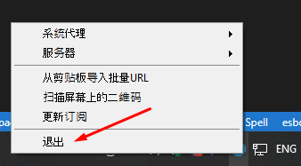

Настройка клиентов
##################

1. v2rayN
=========

Качать здесь

https://github.com/2dust/v2rayN/releases

Устанавливается путем распаковки в любую папку.
При первом запуске, возможно запустится на китайском языке. В этом случае делать нужно так.

Нажимаем на кнопку с вопросительным знаком.

Потом нажимаем Language - English. 
Далее ищем в области уведомлений значок программы, он может быть скрыт, в этому случае разверните область уведомлений полностью нажав на кнопку **^** слева 

Нажимаем на значок программы правой кнопкой мыши и выбираем последний пункт

При следующем запуске программа будет на английском языке.

Далее, нужно скачать Xray. Проще всего это сделать из самой программы.

Далее, проведем настройку. Нажимаем кнопку **Settigns** и настраиваем в соответствии со скриншотами.

Добавим наш сервер.

Нажимаем кнопку **Servers** -> **Add [VLESS] Server**

.. image:: images/v2rayn1.png

После всех настроек, включаем. Нажимаем на значок программы в области уведомлений правой кнопкой мыши и выбираем **Http Proxy** -> **Set system proxy**

2. Shadowrocket (iPhone)
========================

3. V2rayU (macOS)
=================

4. v2rayNG
==========

